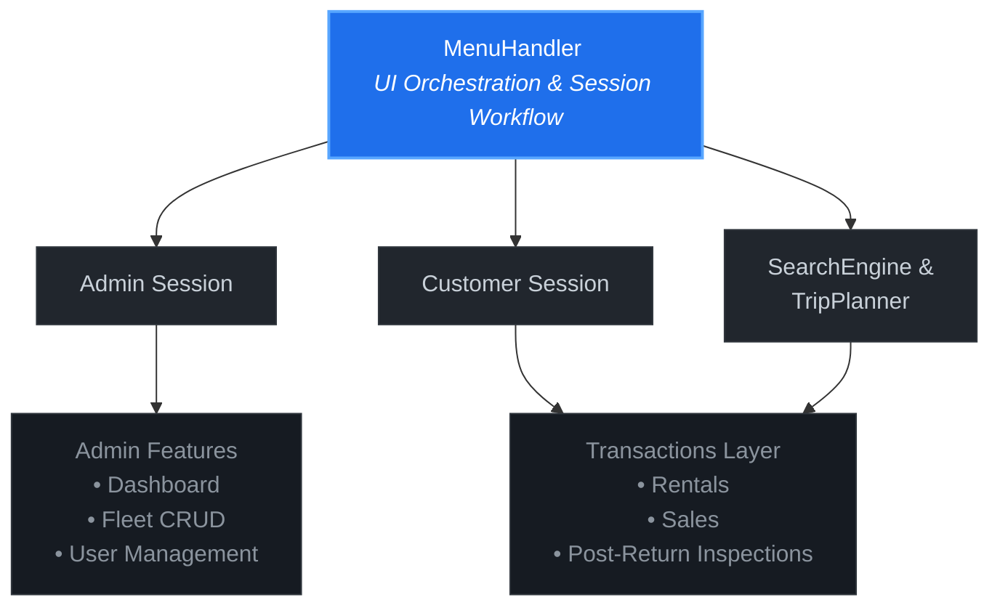

# 🚗 Vehicle Management System (VMS)

A high-performance, console-based vehicle rental and sales orchestration platform built using core **Object-Oriented Programming (OOP)** principles in C++17. 

[](https://en.cppreference.com/w/cpp/17)
[](https://github.com/hmsaeed-dev)
[](https://github.com/hmsaeed-dev/Vehicle-Management-System/wiki)

---

### ⚡ Live Interactive Demo

Test the live console interface directly inside your web browser without installing local compilers or dependencies:

👉 **[Run the Vehicle Management System Live on Replit](https://replit.com/@hmsaeed/Vehicle-Management-System)**

*(Once the Replit workspace provisions, click the green **Run** button at the top to initialize the local flat-file database structures!)*

---

## 📖 Deep-Dive Documentation Hub
Comprehensive step-by-step guides, usage parameters, and edge-case behaviors are hosted in the project repository wiki. 

* 🏠 **[Project Overview & Architecture Core](https://github.com/hmsaeed-dev/Vehicle-Management-System/wiki/Home)**
* 🚀 **[Installation & Local Compilation Matrix](https://github.com/hmsaeed-dev/Vehicle-Management-System/wiki/Getting-Started)**
* 👥 **[Customer Dashboard & Trip Planner Guide](https://github.com/hmsaeed-dev/Vehicle-Management-System/wiki/Customer-User-Guide)**
* ⚙️ **[Admin Panel & Fleet Inventory Control](https://github.com/hmsaeed-dev/Vehicle-Management-System/wiki/Admin-Guide)**
* 🛡️ **[Input Stream Validation & Structural FAQs](https://github.com/hmsaeed-dev/Vehicle-Management-System/wiki/Input-Validation-Rules)**

---

## 🔥 Key Architectural Features

* **Dual-Role Authentication:** Isolated session management wrappers for Administrators (IDs `1001+`) and Customers (IDs `2001+`).
* **Automated Financial Engine:** Native pricing logic incorporating tiered long-term rental discounts (**10%** for 4–7 days, **20%** for 8+ days) and post-rental inspection damage modifiers (**50%** or **200%** daily rate adjustments based on structural tier checks).
* **Trip Planner Engine:** Advanced multi-criteria search algorithms filtering the dynamic fleet array relative to client budget caps, target mileage distances, and minimum passenger tolerances.
* **Persistent Flat-File Database:** Scalable abstract I/O file tracking modules mapping live structures back into pipe-delimited (`|`) local system text sheets dynamically upon stream termination.

---

## 📐 System Architecture



## 📊 Fleet Segmentation Matrix

| Category | Tracking Range | Base Rate Scale (PKR) | Representative Core Implementations |
| :--- | :--- | :--- | :--- |
| 🚗 **Economy** | IDs `3000 - 3999` | Rs. 3,000 - 6,500 | Suzuki Alto, Cultus, Toyota Corolla GLI, Honda City |
| 💎 **Luxury** | IDs `4000 - 4999` | Rs. 45,000 - 80,000 | Audi A6 Prestige, BMW 7 Series, Land Cruiser V8 |
| ⛰️ **SUV** | IDs `5000 - 5999` | Rs. 12,000 - 25,000 | Kia Sportage, Hyundai Tucson, Toyota Fortuner |
| 🚌 **Van** | IDs `6000 - 6999` | Rs. 3,500 - 35,000 | Suzuki Bolan, Toyota Hiace, Luxury Coaster |

---

## 📁 Repository File Tree

```text
Vehicle Manag Sys/
├── Include/              # Abstract blueprints and header compilation modules (.h)
│   ├── Admin.h           # Admin privilege configurations & control dashboard
│   ├── Customer.h        # Customer operations interface & historical profiling
│   ├── Vehicle.h         # Polymorphic base class for vehicle fleet data structures
│   ├── Economy.h         # Specialized vehicle subtype implementations
│   ├── Luxury.h          # Specialized vehicle subtype implementations
│   ├── SUV.h             # Specialized vehicle subtype implementations
│   ├── Van.h             # Specialized vehicle subtype implementations
│   ├── FileHandler.h     # Core I/O serialization & flat-file mapping logic
│   ├── SearchEngine.h    # Multivariant evaluation matching arrays
│   └── InputHandler.h    # Secure type validation & stream clear functions
│
├── Source/               # Implementation modules containing raw application logic (.cpp)
│   ├── main.cpp          # Runtime system orchestration and file validation entry
│   ├── Admin.cpp         # Code block parsing for system dashboard access controls
│   └── Customer.cpp      # Interface handling for rentals and trip planner pipelines
│
├── Docs/                 # Structural asset modeling sheets & Mermaid graphs
│   ├── Flowchart.mmd     # Process pipeline mapping for application logic tracking
│   └── UML-2.mmd         # Object inheritance relationship architectures
│
├── Data/                 # Protected application persistence layer text files (.txt)
│   ├── Vehicle.txt       # Dynamic live fleet inventory array configurations
│   ├── Users.txt         # Pipe-separated credential strings for safe login parsing
│   ├── Transactions.txt  # Cumulative chronological purchase and rental histories
│   └── Inspections.txt   # Mechanical evaluation checklists generated upon returns
│
├── build.bat             # Automation script for rapid compilation and environment boot
└── README.md             # This core documentation tracking module
```
---

## 👨‍💻 Engineering Lead

* **Hafiz Muhammad Saeed** – Web Developer & Computer Science Student
* Team Members: Wajeeh-ul-Hassan, Muhammad Irfan Yasir, Hamza Khurram
* GitHub Profile: **[@HMSaeed101](https://github.com/HMSaeed101)**
* Portfolio: **[hmsaeed.com](https://hmsaeed.com)**
